# Tripzy Sri Lanka - Complete Project Architecture Class Diagram

This document contains a comprehensive, highly accurate Unified Modeling Language (UML) Class Diagram representing the full architecture of **Tripzy Sri Lanka**, covering both the frontend React Single Page Application components/services and the backend PHP MVC/REST API.

---

## 1. Complete UML Class Diagram (Mermaid)

```mermaid
classDiagram
    direction TB

    %% ==========================================
    %% FRONTEND - CLIENT SIDE LAYER (React & JS)
    %% ==========================================

    class App {
        +State currentUser
        +State theme
        +State activeTab
        +State toasts
        +State modalState
        +useEffect() initSession()
        +checkSession()
        +toggleTheme()
        +performLogout()
        +showAlert(message, title, severity)
        +showConfirm(message, onConfirm, title)
    }

    class AppRoutes {
        <<Router>>
        +Route "/home" (Home)
        +Route "/explore" (Explore)
        +Route "/companions" (CompanionFinder)
        +Route "/auth" (Auth)
        +Route "/dashboard" (Dashboard)
    }

    class ExplorePage {
        +State destinations
        +State selectedDest
        +State weatherData
        +State weatherLoading
        +fetchDestinations()
        +fetchWeatherData(lat, lon)
        +getWeatherAdvisory(currentRain, dailyData)
    }

    class CompanionFinderPage {
        +State posts
        +State incomingRequests
        +State sentRequests
        +handleCreatePost()
        +handleSendRequest()
    }

    class TouristDashboard {
        +Tab BookServicesTab
        +Tab BookingsTab
        +Tab CompanionTab
        +Tab ProfileTab
        +Tab NotificationsTab
    }

    class ProviderDashboard {
        +Tab ListingsTab
        +Tab ReservationsTab
        +Tab NotificationsTab
    }

    class AdminDashboard {
        +Tab StatsTab
        +Tab UserApprovalsTab
        +Tab ManageDestinationsTab
        +Tab ManageFaqsTab
    }

    class ApiClient {
        +String API_BASE
        +apiRequest(controller, action, method, data)
        +getUploadUrl(path)
        +getProfilePhoto(photo)
        +getCookie(name)
    }

    class FrontendAuthService {
        +login(email, password)
        +register(formData)
        +logout()
        +getCurrentUser()
        +resetPassword(password)
    }

    class FrontendCompanionService {
        +createPost(data)
        +listPosts(filters)
        +sendRequest(data)
        +getIncomingRequests()
        +getMyRequests()
        +getMyPosts()
        +closePost(postId)
        +deletePost(postId)
    }

    %% ==========================================
    %% BACKEND - API ROUTING & MIDDLEWARE LAYER
    %% ==========================================

    class BackendEntry {
        <<Index.php>>
        +String controller
        +String action
        +Array exemptedActions
        +routerDispatcher()
    }

    class SessionMiddleware {
        +handle()
    }

    class CORSMiddleware {
        +handle()
    }

    class AuthMiddleware {
        +requireLogin()
        +requireTourist()
        +requireProvider()
        +requireAdmin()
    }

    %% ==========================================
    %% BACKEND - CONTROLLER LAYER (MVC)
    %% ==========================================

    class AuthController {
        -AuthService authService
        +login(input, args)
        +register(input, args)
        +logout(input, args)
        +me(input, args)
    }

    class ProfileController {
        -ProfileService profileService
        +update(input, args)
    }

    class CompanionsController {
        -CompanionService compService
        +create_post(input, args)
        +list_posts(input, args)
        +my_posts(input, args)
        +send_request(input, args)
        +incoming_requests(input, args)
        +update_request(input, args)
        +close_post(input, args)
        +delete_post(input, args)
    }

    class BookingsController {
        -BookingService bookingService
        +create(input, args)
        +my_bookings(input, args)
        +provider_bookings(input, args)
        +update_status(input, args)
    }

    class ServicesController {
        -ServiceService serviceService
        +create(input, args)
        +list(input, args)
        +my_services(input, args)
        +add_review(input, args)
    }

    class DestinationsController {
        -DestinationService destService
        +create(input, args)
        +list(input, args)
        +delete(input, args)
    }

    %% ==========================================
    %% BACKEND - SERVICE & VALIDATOR LAYER
    %% ==========================================

    class AuthService {
        -UserRepository userRepo
        +login(email, password)
        +register(data)
    }

    class ProfileService {
        -UserRepository userRepo
        +update(userId, data)
    }

    class CompanionService {
        -CompanionRepository compRepo
        +createPost(data)
        +getPosts(filters)
        +sendRequest(data)
        +updateRequestStatus(reqId, userId, status)
        +closePost(postId, userId)
        +deletePost(postId, userId)
    }

    class BookingService {
        -BookingRepository bookingRepo
        -UserRepository userRepo
        +create(data)
        +getMyBookings(touristId)
        +getProviderBookings(providerId)
        +updateStatus(bookingId, userId, status)
    }

    class ServiceService {
        -ServiceRepository serviceRepo
        +create(data)
        +getServices(filters)
        +addReview(data)
    }

    class UserValidator {
        +validateRegistration(data)
        +validateLogin(data)
    }

    class CompanionValidator {
        +validatePost(data)
        +validateRequest(data)
    }

    %% ==========================================
    %% BACKEND - REPOSITORY & DATA LAYER
    %% ==========================================

    class UserRepository {
        -PDO db
        +create(email, hash, type)
        +createTouristProfile(id, data)
        +createProviderProfile(id, data)
        +getByEmail(email)
        +getById(id)
    }

    class CompanionRepository {
        -PDO db
        +createPost(data)
        +getPosts(filters)
        +sendRequest(data)
        +getIncomingRequests(userId)
        +updateRequestStatus(requestId, status)
        +closePost(postId)
        +deletePost(postId)
    }

    class BookingRepository {
        -PDO db
        +create(data)
        +getOverlappingBookings(serviceId, start, end)
        +getForTourist(touristId)
        +getForProvider(providerId)
        +updateStatus(bookingId, status)
    }

    class ServiceRepository {
        -PDO db
        +create(data)
        +getServices(filters)
        +addReview(data)
        +getReviews(serviceId)
    }

    class Database {
        -Database instance
        -PDO conn
        +getInstance()
        +getConnection()
    }

    class Mailer {
        +send(to, subject, body)
    }

    class UploadHelper {
        +uploadImageFile(fieldName, targetDir)
    }

    %% ==========================================
    %% RELATIONSHIPS AND DEPENDENCIES
    %% ==========================================

    %% Frontend Interactions
    App --> AppRoutes : mounts
    AppRoutes --> ExplorePage : renders
    AppRoutes --> CompanionFinderPage : renders
    AppRoutes --> TouristDashboard : renders
    AppRoutes --> ProviderDashboard : renders
    AppRoutes --> AdminDashboard : renders

    ExplorePage --> ApiClient : uses apiRequest
    CompanionFinderPage --> FrontendCompanionService : calls
    FrontendCompanionService --> ApiClient : uses apiRequest
    FrontendAuthService --> ApiClient : uses apiRequest

    %% Frontend to Backend Boundary
    ApiClient ..> BackendEntry : sends HTTP requests

    %% Backend Entry Routing
    BackendEntry --> SessionMiddleware : handles session & CSRF
    BackendEntry --> CORSMiddleware : handles headers
    BackendEntry --> AuthMiddleware : checks authorization
    BackendEntry --> AuthController : dispatches
    BackendEntry --> ProfileController : dispatches
    BackendEntry --> CompanionsController : dispatches
    BackendEntry --> BookingsController : dispatches
    BackendEntry --> ServicesController : dispatches
    BackendEntry --> DestinationsController : dispatches

    %% Controllers to Services
    AuthController --> AuthService : uses
    ProfileController --> ProfileService : uses
    CompanionsController --> CompanionService : uses
    BookingsController --> BookingService : uses
    ServicesController --> ServiceService : uses

    %% Services to Validators (Dependency Injection/Static calls)
    AuthService ..> UserValidator : validates data
    CompanionService ..> CompanionValidator : validates data

    %% Services to Repositories
    AuthService --> UserRepository : queries
    ProfileService --> UserRepository : queries
    CompanionService --> CompanionRepository : queries
    BookingService --> BookingRepository : queries
    ServiceService --> ServiceRepository : queries

    %% Repositories to Database Connectivity
    UserRepository --> Database : gets PDO connection
    CompanionRepository --> Database : gets PDO connection
    BookingRepository --> Database : gets PDO connection
    ServiceRepository --> Database : gets PDO connection

    %% Auxiliary Helper invocations
    BookingService --> Mailer : sends reservation alerts
    CompanionService --> Mailer : sends contact details
    ProfileController --> UploadHelper : saves avatar image
    ServicesController --> UploadHelper : saves service covers
```

---

## 2. Structural Layer Descriptions

### A. Frontend Client Layer (React Single Page Application)
- **Central State Manager (`App.jsx`)**: Manages the logged-in user profile, system themes (Dark/Light toggle), application navigation targets, and modal components.
- **API Boundary Client (`api.js`)**: Encapsulates network communication. Attaches session parameters, configures cross-origin requests, fetches cookies, and appends the secure `X-XSRF-TOKEN` header.
- **Feature Modules**:
  - `ExplorePage`: Integrates coordinates-based climate forecast queries targeting the OpenWeatherMap API and displays contextual recommendations.
  - `CompanionFinderPage`: Orchestrates active travel matching posts and handles join requests.

### B. Backend Entry & Security Layer (PHP Middleware)
- **Front Controller (`index.php`)**: Processes incoming path parameters, handles input payload parsing, and maps route destinations.
- **`SessionMiddleware`**: Configures cookie session variables securely and manages generation of CSRF tokens (`XSRF-TOKEN`).
- **`AuthMiddleware`**: Enforces strict role authentication scopes (`requireAdmin()`, `requireTourist()`, `requireProvider()`).

### C. Core Logic & Data Access Layers (Service-Repository Pattern)
- **Controllers**: Responsible for decoding incoming JSON body payloads, dispatching commands to service classes, and returning structured JSON API outputs.
- **Service Layer**: Implements business transactions, controls email triggers via `Mailer.php`, and references domain-specific validators.
- **Repository Layer**: Coordinates CRUD database routines. Uses **PDO Prepared Statements** directly to prevent SQL injection vulnerabilities.
- **`Database` Class**: Implements a Thread-Safe **Singleton Design Pattern** to maintain a single reusable connection instance to the MySQL server.
